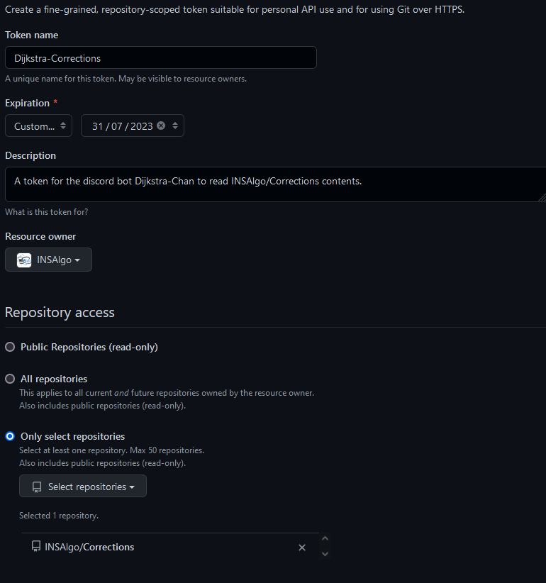

# Setup info

If you want to run it locally, first get your hand on the tokens (ask the current admin) to add them to your environment variables. 
Then you can do :
- `git clone --recurse-submodule https://github.com/INSAlgo/Dijkstra-Chan.git`,
- `python -m venv env`,
- `env/Scripts/activate` (win) or `source env/bin/activate` (lin),
- `pip install -r requirements.txt`,
- and finally : `python main.py`

## Connect to VPS to debug
`ssh <adresse> -p <port>`
input pwd
`cd Dijkstra-Chan/`
logs are in nohup.out

### To launch the bot from the VPS :
`source ./env/bin/activate`
`nohup python ./main.py &`

## Discord Token
If the token was reset, you can generate a new token in the [discord developer portal](https://discord.com/developers), but someone will need to give you authorizations, so ask for the previous head of INSAlgo on the discord server (they should still be "ancients"). 
To give authorization to a new bureau, select the team "Dijkstra-Chan administrators" in the "Teams" tab, then invite new members. You can also transfer team ownership to the new head of INSAlgo.

## GitHub Token
For the bot to access the repository with exercise corrections, you'll need to provide him with an access token (else he only has 60 queries per hour). Here is a tutorial on how to set it up :
- You need to be an administrator of the association INSAlgo on GitHub.
- Go to your profile's Settings -> Developer settings -> Fine-grained tokens.
- Select "Generate new token".
- Fill these settings (change the expiration date to the end of your mandate) : 

- Then, in the permissions, choose "Contents".
- You can now generate the token and copy the string given, paste it somewhere safe now to avoid losing it.